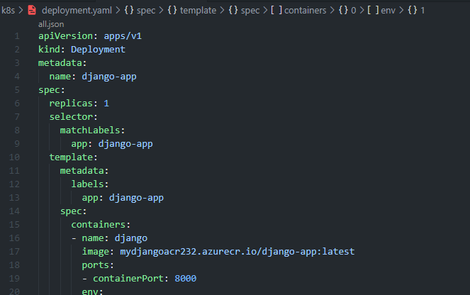
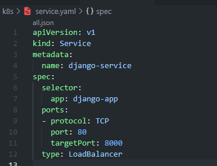
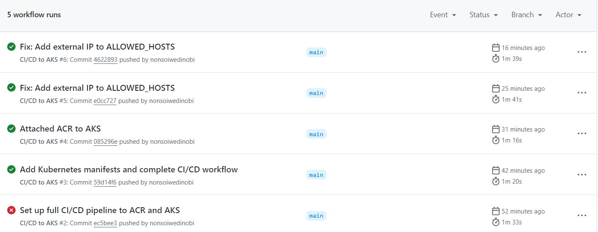

# Django App Deployment to Azure Kubernetes Service (AKS) with CI/CD 

This project demonstrates how to containerize a Django web application and deploy it to Azure Kubernetes Service (AKS) using GitHub Actions for a full CI/CD pipeline.

---

## Stack Used

- **Django** 5.2 (Web Framework)
- **Docker** (Containerization)
- **Azure Container Registry (ACR)** (Image Storage)
- **Azure Kubernetes Service (AKS)** (Orchestration)
- **GitHub Actions** (CI/CD Pipeline)
- **Whitenoise** (Static file management)
- **Gunicorn** (Production server)

---

## Key Features

- Clean and production-ready Dockerfile
- Kubernetes manifests (`deployment.yaml`, `service.yaml`)
- CI/CD workflow via GitHub Actions
- Automatically builds, pushes to ACR, and deploys to AKS on every `main` branch push
- Exposes app to public via LoadBalancer service

---

---

## Deployment Screenshots

Here’s a step-by-step visual guide to the deployment process:

### 1. Dockerizing the Django App
> Created a `Dockerfile` and ran it locally to ensure the app worked in a container.

### 2. Running Locally with Docker
> Built and ran the container on port 5000.

### 3. Creating Azure Resource Group
> Using Azure CLI to organize resources.

### 4. Creating Azure Container Registry (ACR)
> Used `az acr create` to store Docker images.

[alt text](<Screenshot 2025-06-08 142549.png>)

### 5. Pushing Image to ACR
> Tagged and pushed Docker image to the container registry.

### 6. Kubernetes Deployment & Service
> Deployed to AKS using YAML manifests.

### 7. GitHub Actions CI/CD Pipeline
> Pushed code to `main` and watched GitHub deploy automatically to AKS.

### 8. App Live on External IP
> Final app served on AKS LoadBalancer external IP.

---

